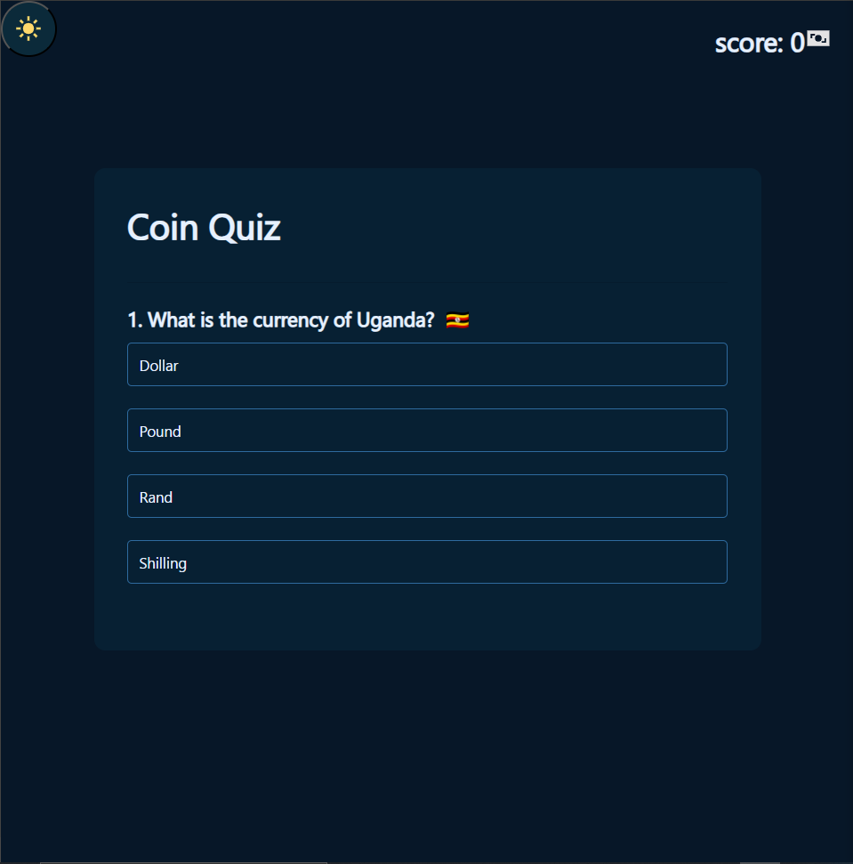

# Coin Quiz APP
## About

---
The "Coin Quiz App" is an educational website that tells you about currencies of the countries in the form of Quiz.

Each time you play the game you got asked about the currencies of ten different countries, and with each correct answer you gain a coin.

---
## Features
- Gamedied Quiz theme.
- large data set of 150+ countries
- Interactive User interface
- Cross device compatiblity
- Ease of access.

---
## Tech Stack
- **Frontend** HTML, CSS
- **Backend** JavaScript

---
## How to play
Go to the website throw this [link](https://alyalgendy.github.io/Coin-Quiz-app/)
to take the quiz and know more about the currencies arround the world.

---
## Folder Structure
```
my-weather-app/
├── index.html
├── style.css
├── script.js
├── darkmode.js
├── README.md
```
---
## Contributing
Contributions are welcome! Please open issues or submit pull requests for new features, bug fixes, or enhancements.

---
## License
This project is licensed under the MIT License. See the [LICENSE](LICENSE) file for details.

---
**Created by [alyalgendy](https://github.com/alyalgendy)**